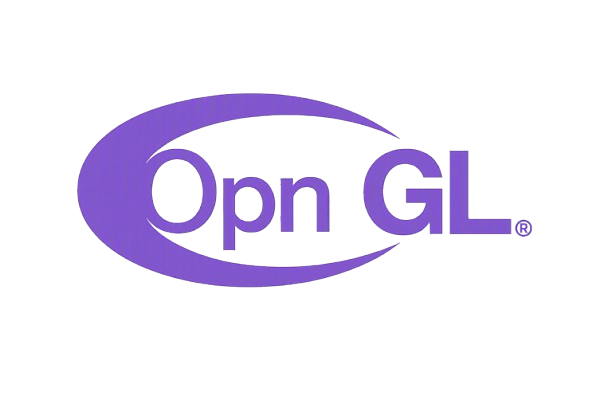

<div align="center">

<<<<<<< HEAD

=======
# OpnGL
>>>>>>> main/main

**Motor gráfico sobre Vulkan puro, escrito en Python.**


<<<<<<< HEAD


=======


Ventana GLFW sin contexto OpenGL (CLIENT_API = NO_API), renderizado **100 %
Vulkan** (swapchain, render pass, pipelines, command buffers) y una **UI de
widgets** definida de forma declarativa en XML o directamente en código.

>>>>>>> main/main
<sub>Proyecto de [BluePanda](https://github.com/aminbena010-ai) — ver [Licencia](#licencia).</sub>

</div>

---

<<<<<<< HEAD
## Instalación

Requiere Python **3.9+**, drivers de **Vulkan** (`libvulkan.so.1`) y
`glslangValidator` en el `PATH`.

```bash
pip install opngl                       # sonido opcional: pip install "opngl[audio]"
```

Para instalarlo desde este repositorio:

```bash
git clone https://github.com/aminbena010-ai/OpnGL.git
cd OpnGL
pip install .
=======
## Índice

- [Características](#características)
- [Arquitectura](#arquitectura)
- [Requisitos](#requisitos)
- [Instalación](#instalación)
- [Primeros pasos](#primeros-pasos)
- [UI declarativa con XML](#ui-declarativa-con-xml)
- [UI 100 % en código](#ui-100--en-código)
- [Múltiples interfaces y transiciones](#múltiples-interfaces-y-transiciones)
- [Widgets](#widgets)
- [Eventos](#eventos)
- [Imágenes](#imágenes)
- [Sonido](#sonido)
- [Fuentes](#fuentes)
- [Dibujo personalizado por frame](#dibujo-personalizado-por-frame)
- [API de bajo nivel](#api-de-bajo-nivel)
- [Shaders](#shaders)
- [Resolución de recursos](#resolución-de-recursos)
- [Licencia](#licencia)

---

## Características

- **Vulkan puro**: GLFW crea únicamente la ventana y la superficie
  `VkSurfaceKHR` con `CLIENT_API = NO_API`. No existe ningún contexto OpenGL.
- **UI declarativa**: define interfaces como árboles de widgets en **XML** o
  en código, con layout automático (`VBox`, `HBox`, `Panel`, `AppWindow`),
  alineación (`align`), empaquetado (`pack`) y `padding`/`spacing`.
- **Varias interfaces**: carga varios XML como pantallas y cambia entre ellas
  con **transiciones de fundido** (fade).
- **Widgets listos**: `Button`, `Label`, `Image`, `TextInput` y contenedores,
  con estados hover/pressed, esquinas redondeadas, bordes y gradientes.
- **TextInput completo**: cursor intermitente, placeholder, edición con
  teclado (Backspace/Delete, flechas, Home/End), portapapeles **Ctrl+C/V/X**,
  `Enter` para enviar, `ESC` para quitar el foco y `max_length`.
- **Fuentes**: familia por defecto *DejaVu* (TrueType incluida) y fuente
  bitmap 8×8 de respaldo, renderizadas como atlas de glifos en la GPU.
- **Imágenes**: PNG/JPG cargadas con Pillow y subidas a texturas Vulkan con
  corrección sRGB, ajuste `stretch/fill/contain/cover`, opacidad y tinte.
- **Sonido**: WAV/OGG/MP3/FLAC con *miniaudio*, mezcla simultánea, volumen
  global/individual y loop. El audio es opcional: el motor funciona igual sin
  miniaudio o sin tarjeta de sonido.
- **Shaders GLSL 450** compilados a SPIR-V en caliente con `glslangValidator`
  (rectángulos redondeados con SDF, texto por atlas y blend premultiplicado
  para imágenes sin halos).
- **Color correcto**: la swapchain es sRGB y los colores hex de la UI se
  convierten a lineal para evitar aplicar la gamma dos veces.
- **Bajo nivel accesible**: la clase `OpnGL` expone `device`, `swapchain` y
  `renderer` para quien quiera control total de Vulkan.

---

## Arquitectura

```
opngl/
├── __init__.py          # App (modo supremo) y OpnGL (bajo nivel)
├── __main__.py          # Demo: python -m opngl
├── core/                # Núcleo Vulkan
│   ├── window.py        #   Ventana GLFW (NO_API, sin OpenGL jamás)
│   ├── device.py        #   VulkanDevice: instancia, superficie, colas
│   ├── swapchain.py     #   VulkanSwapchain: imágenes, views, profundidad
│   ├── renderer.py      #   Renderer: render pass, pipelines, sync
│   ├── vkutil.py        #   utilidades de bajo nivel (extensiones KHR)
│   └── context.py       #   contexto global estilo OpenGL
├── graphics/            # Recursos gráficos
│   ├── pipeline.py      #   GraphicsPipeline declarativo
│   ├── shader.py        #   ShaderProgram (GLSL -> SPIR-V -> módulo)
│   ├── buffer.py        #   Vertex/Index/Dynamic buffers
│   ├── texture.py       #   Texture y FontAtlas (8x8 y TrueType)
│   ├── fonts.py         #   FontManager por familia
│   ├── images.py        #   ImageManager (PNG/JPG -> textura)
│   └── font8x8.py       #   fuente bitmap 8×8 de dominio público
├── renderer/
│   └── ui.py            # UIRenderer: árbol, eventos y transiciones
├── widgets/             # Widgets de la UI
│   ├── base.py          #   UIWidget y Batch de geometría
│   ├── containers.py    #   AppWindow, VBox, HBox, Panel
│   ├── button.py        #   Button
│   ├── label.py         #   Label
│   ├── image.py         #   Image
│   └── textinput.py     #   TextInput
├── xml_parser/          # UI declarativa
│   ├── parser.py        #   XMLUIParser y registro de tags
│   └── layout.py        #   medición y posicionamiento
├── audio/               # AudioManager (miniaudio, diferido)
├── shaders/             # GLSL 450: ui.vert, ui_shape/ui_text/ui_image.frag
└── resources/           # recursos del motor
    ├── fonts/           #   DejaVuSans.ttf (familia por defecto)
    ├── images/          #   imágenes incluidas
    └── sounds/          #   sonidos incluidos
>>>>>>> main/main
```

---

<<<<<<< HEAD
## Uso mínimo
=======
## Requisitos

- Python **3.9+** (se usan uniones de diccionarios `|` y `f-strings`).
- Un sistema con **drivers de Vulkan** y `libvulkan.so.1`.
- [glslangValidator](https://github.com/KhronosGroup/glslang) en el `PATH`
  (compila los shaders GLSL a SPIR-V en tiempo de ejecución).
- Dependencias Python:

```bash
pip install glfw vulkan pillow
pip install miniaudio    # opcional: solo si quieres sonido
```

---

## Instalación

```bash
git clone https://github.com/aminbena010-ai/OpnGL.git
cd OpnGL
pip install -r requirements.txt   # o los paquetes de la sección anterior
```

También puedes ejecutar la demo integrada:

```bash
python -m opngl
```

---

## Primeros pasos

La forma recomendada es usar la clase `App`:

```python
from opngl import App

app = App("ui.xml", title="Mi App")       # UI declarativa desde XML
app.on_click("btn_close", lambda b: app.quit())
app.run()
```

O construir la interfaz por completo en código:
>>>>>>> main/main

```python
from opngl import App

app = App(title="Mi App")
<<<<<<< HEAD
app.label(text="Motor OpnGL activo (Vulkan puro)", font_size=22)
app.button(text="Cerrar", id="btn_close")
=======

app.label(text="Motor OpnGL activo (Vulkan puro)", font_size=22)
app.button(text="Cerrar", id="btn_close")

>>>>>>> main/main
app.on_click("btn_close", lambda b: app.quit())
app.run()
```

<<<<<<< HEAD
También puedes definir la UI declarativamente desde XML: `App("ui.xml")`.
Demo integrada: `python -m opngl` o el comando `opngl`.
=======
---

## UI declarativa con XML

Crea un archivo como `ui.xml`:

```xml
<AppWindow width="800" height="600" background="#111827" padding="20" spacing="12">
  <VBox spacing="16">
    <Label text="Hola OpnGL" font_size="28" color="#facc15" align="center"/>
    <Button text="Jugar" id="btn_play" sound="click.wav"/>
    <Button text="Cerrar" id="btn_close" background="#ef4444" hover_background="#f87171"/>
    <TextInput id="txt_nombre" placeholder="Escribe tu nombre" max_length="20"/>
    <Image src="logo.png" width="160" height="160" fit="contain"/>
  </VBox>
</AppWindow>
```

Y cárgalo:

```python
from opngl import App

app = App("ui.xml", title="Mi App")
app.on_click("btn_play", lambda b: app.play_sound("click.wav"))
app.on_click("btn_close", lambda b: app.quit())
app.run()
```

> Los atributos usan guiones o guiones bajos indistintamente
> (`font-size` = `font_size`). Los colores se escriben como `#rrggbb` o
> `#rrggbbaa`. Cualquier tag/atributo desconocido lanza un error con contexto.

---

## UI 100 % en código

`App` ofrece métodos para construir el árbol sin XML:

```python
from opngl import App

app = App(title="Mi App")

v = app.vbox(spacing=12, padding=20)
v.add(app.label(text="Panel de control", font_size=24))
v.add(app.button(text="Iniciar", id="btn_start"))
v.add(app.text_input(id="ip", placeholder="IP del servidor"))

app.on_click("btn_start", lambda b: print("¡Iniciando!", app.widget("ip").text))
app.run()
```

Constructores disponibles: `app.vbox`, `app.hbox`, `app.panel`,
`app.button`, `app.label`, `app.image`, `app.text_input` y `app.add`.

---

## Múltiples interfaces y transiciones

```python
app = App(title="Mi Juego")

app.load_interface("menu", "menu.xml")       # sin mostrarla
app.load_interface("juego", "juego.xml")

app.set_interface("menu")
# ...en el juego...
app.set_interface("juego", transition=True, duration=0.4)   # fundido
```

Los handlers se pueden registrar aunque la interfaz no esté visible;
`app.widget("id")` busca en la interfaz activa y en el resto de interfaces
cargadas.

---

## Widgets

| Widget       | Descripción | Atributos destacados |
|--------------|-------------|----------------------|
| `AppWindow`  | Raíz: ocupa la ventana y pinta el fondo | `background`, `padding`, `border_radius` |
| `VBox` / `HBox` | Apilado vertical/horizontal | `spacing`, `padding`, `align`, `pack` |
| `Panel`      | Contenedor con fondo opcional | `background`, `border_radius`, `gradient` |
| `Button`     | Botón con estados hover/pressed | `text`, `background`, `hover_background`, `pressed_background`, `sound`, `font` |
| `Label`      | Texto multilínea | `text`, `font_size`, `color`, `align`, `valign`, `font` |
| `Image`      | Imagen con ajuste | `src`, `fit` (stretch/fill/contain/cover), `opacity`, `tint` |
| `TextInput`  | Campo de texto de una línea | `placeholder`, `max_length`, `focused_border_color` |

Todos los widgets aceptan `id`, `x`, `y`, `width`, `height` y `z`.

---

## Eventos

```python
app.on_click("boton1", lambda b: print("Click!"))
app.on_frame(lambda app: print("frame", app.window.framebuffer_size()))
```

- `on_click(widget_id, handler)` — registra el clic. Si el botón XML tiene
  `sound=""`, se reproduce el sonido antes de llamar al manejador.
- `on_frame(handler)` — callback por frame: `handler(app)`.
- Los `TextInput` exponen `on_change(handler)` y `on_submit(handler)`.

---

## Imágenes

```python
app.load_image("assets/logo.png")          # se sube a la GPU y se cachea
app.image(src="assets/logo.png", width=160, height=160, fit="cover")
```

Formato: PNG/JPG (y otros soportados por Pillow). Las texturas se crean en
`R8G8B8A8_SRGB` con filtrado lineal, de modo que se ven con el color correcto
y sin pixelado al escalar.

---

## Sonido

```python
app.load_sound("sounds/clic.wav")          # WAV/OGG/MP3/FLAC
app.play_sound("clic.wav", volume=0.8, loop=True)
app.set_sound_volume(0.5)
```

- El dispositivo de audio se abre de forma diferida (en el primer `play`),
  por lo que `App()` funciona en equipos sin tarjeta de sonido.
- Si `miniaudio` no está instalado o no hay backend, el resto del motor sigue
  funcionando y se muestra un aviso por consola.
- Los botones XML pueden reproducir sonido automáticamente con `sound="..."`.

---

## Fuentes

- La familia por defecto es **dejavu** (`resources/fonts/DejaVuSans.ttf`,
  incluida en el motor).
- La fuente bitmap **8×8** de dominio público (font8x8_basic de Daniel
  Hepper) se usa como respaldo y como atlas base.
- Se selecciona con el atributo `font="..."` de `Label`/`Button`. Cualquier
  `.ttf` colocado en `resources/fonts/` se registra automáticamente por
  nombre de archivo.

```xml
<Label text="Título" font="dejavu" font_size="24"/>
```

---

## Dibujo personalizado por frame

Puedes dibujar geometría personalizada con los pipelines del motor:

```python
@app.on_frame
def frame(app):
    app.clear_color(0.07, 0.08, 0.12, 1.0)
    # Dibuja un rectángulo redondeado: 6 vértices (x, y, z, r, g, b, a, u, v)
    app.draw([
        100, 100, 0, 1.0, 0.5, 0.2, 1.0, 0, 0,
        300, 100, 0, 1.0, 0.5, 0.2, 1.0, 0, 0,
        300, 200, 0, 1.0, 0.5, 0.2, 1.0, 0, 0,
        100, 100, 0, 1.0, 0.5, 0.2, 1.0, 0, 0,
        300, 200, 0, 1.0, 0.5, 0.2, 1.0, 0, 0,
        100, 200, 0, 1.0, 0.5, 0.2, 1.0, 0, 0,
    ], rect_size=(200, 100), radius=12.0)
```

`app.readback(x, y, w, h)` devuelve los píxeles RGBA de la imagen actual
(útil para tests y verificaciones).

---

## API de bajo nivel

Para acceso directo al motor (compatibilidad con OpnGL clásico):

```python
from opngl import OpnGL

app = OpnGL.init(title="Vulkan puro")       # App + device + swapchain + renderer
OpnGL.run()
```

`OpnGL` expone `app`, `device`, `swapchain`, `renderer` y `window`, más
ayudantes como `OpnGL.load_shader(...)` y `OpnGL.create_vertex_buffer(...)`.

---

## Shaders

Los shaders viven en `opngl/shaders/` en GLSL 450 y se compilan a SPIR-V en
caliente con `glslangValidator`:

| Archivo            | Pipeline  | Función |
|--------------------|-----------|---------|
| `ui.vert`          | (todos)   | convierte píxeles (origen arriba-izq) a NDC de Vulkan |
| `ui_shape.frag`    | `shape`   | rectángulos redondeados con SDF, bordes y gradientes |
| `ui_text.frag`     | `text`    | muestrea el atlas de glifos de la fuente |
| `ui_image.frag`    | `image`   | imágenes con blend premultiplicado (sin halos) |

Formato de vértice de la UI: `pos(3) + color(4) + uv(2)` = 9 floats = 36
bytes. La geometría se acumula en un `DynamicBuffer` host-visible de 8 MB por
frame.

---

## Resolución de recursos

Imágenes, sonidos y fuentes se buscan, en este orden:

1. La ruta tal cual (absoluta o relativa al directorio de trabajo).
2. Relativa al directorio del **script lanzado** (`sys.argv[0]`): así
   `app.load_image("logo.png")` encuentra `logo.png` junto a tu `.py`.
3. Dentro de `opngl/resources/<subdir>` (recursos del propio motor).
>>>>>>> main/main

---

## Licencia

**OpnGL** se distribuye bajo la **Licencia MIT con cláusula de atribución a
<<<<<<< HEAD
BluePanda**. Texto completo en [`LICENSE`](LICENSE).

```text
Copyright (c) 2026 BluePanda
```
=======
BluePanda** — software 100 % libre para usar, copiar, modificar y distribuir.

- Uso, copia, modificación y distribución: **libres**, sin restricciones de
  uso comercial o personal.
- Condiciones: conservar el aviso de copyright y mantener, de forma visible,
  la **mención de "BluePanda"** como desarrollador original del proyecto en
  cualquier copia, modificación o trabajo derivado.

```text
Copyright (c) 2026 BluePanda
OpnGL — Motor gráfico sobre Vulkan puro (Python).
```

Texto completo en el archivo [`LICENSE`](LICENSE).

### Recursos de terceros

- **DejaVu Sans** (incluida en `resources/fonts/`): derivada de Bitstream
  Vera, distribuida bajo la *Bitstream Vera License* (uso libre con
  atribución); algunas porciones son de dominio público.
- **font8x8_basic** (Daniel Hepper): fuente bitmap de dominio público.
>>>>>>> main/main
